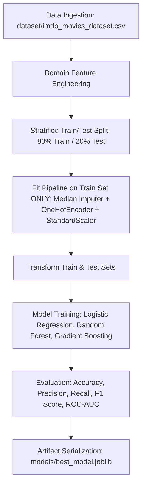

# Project Documentation: IMDb Rating Category Prediction

## 1. Project Title
**IMDb Rating Category Prediction & Strategic Content Recommendation System**

---

## 2. Problem Statement
### What Problem is Being Solved?
In the film production and digital distribution industry, predicting the eventual critical and audience rating of a film prior to release is crucial. Streaming platforms, OTT networks, and theatrical distributors spend millions acquiring film rights without data-driven certainty regarding how the content will perform.

This project addresses the problem of **pre-release film quality classification** by building a Machine Learning model that classifies movies and short films into three distinct IMDb rating categories:
- **High Category**: Expected IMDb Score $\ge 7.5$
- **Medium Category**: Expected IMDb Score $5.5 - 7.4$
- **Low Category**: Expected IMDb Score $< 5.5$

### Why is This Problem Important?
1. **Risk Mitigation in Content Acquisition**: Minimizes financial losses from acquiring underperforming titles.
2. **Optimized Marketing Allocation**: Enables targeted marketing budgets based on predicted quality tier.
3. **Data-Driven Scheduling**: Assists platforms in prime carousel placement vs ad-supported catalog tiering.

---

## 3. Proposed Solution
The proposed solution is a full-stack Machine Learning application featuring:
- **Modular Data Pipeline**: Implements clean feature engineering and leakage-free scaling/encoding.
- **Ensemble ML Classifier**: Trains and compares multiple algorithms (Logistic Regression, Random Forest, Gradient Boosting).
- **Automated Recommendation Engine**: Translates classification outputs into actionable commercial advice (Acquisition Tiers, Action Badges, Marketing Strategy).
- **Interactive Web Interface**: A modern dark-mode Streamlit dashboard allowing users to input metadata, run live predictions, inspect feature importance, and view EDA plots.

---

## 4. System Architecture

### Workflow & Data Flow Diagram

### Component Breakdown
1. **Frontend**: Streamlit interactive user interface with glassmorphic cards and visualizations.
2. **Backend Engine**: Python modular modules (`data_loader`, `feature_engineering`, `preprocessing`, `predict`).
3. **ML Module**: Scikit-Learn Random Forest and Gradient Boosting classifiers.
4. **Storage Layer**: Serialized model artifacts (`best_model.joblib`, `preprocessor.joblib`, `model_metadata.json`).

---

## 5. Technology Stack
- **Language**: Python 3.14
- **Libraries**:
  - `pandas` & `numpy`: Data manipulation & array operations
  - `scikit-learn`: Data preprocessing, pipelines, model training & metrics evaluation
  - `xgboost`: Gradient boosting algorithms
  - `matplotlib` & `seaborn`: Visualization charts & confusion matrix heatmaps
  - `streamlit`: Web app deployment
  - `joblib`: Model serialization

---

## 6. Machine Learning Workflow

### Detailed Workflow Steps:
1. **Dataset Loading**: 1,800 records of movies and short films.
2. **Data Preprocessing**: Handling missing values using median imputation for numerical features and mode imputation for categorical attributes.
3. **Feature Engineering**:
   - `is_short_film`: Indicator flag ($< 40$ minutes).
   - `budget_per_minute`: Budget divided by runtime.
   - `star_synergy_score`: Product of director reputation score and cast star power score.
   - `marketing_ratio`: Marketing budget divided by production budget.
   - `release_decade`: Release year converted to decade.
   - `log_budget`: Logarithmic transformation of budget to handle skewness.
4. **Model Selection & Benchmarking**: Evaluated Random Forest, Gradient Boosting, and Logistic Regression.
5. **Prediction & Post-Processing**: Computes class probabilities and maps outputs to strategic recommendations.

---

## 7. Algorithm Selection & Justification

### Selected Algorithm: **Random Forest Classifier**
- **Why Selected**:
  1. **Non-Linear Relationships**: Film rating prediction involves complex non-linear interactions between budget, director reputation, and genre.
  2. **Robustness to Overfitting**: Ensemble of decision trees with bagging reduces variance and handles multi-modal feature distributions effectively.
  3. **Interpretability**: Provides feature importances to highlight key drivers influencing film ratings.
  4. **Multi-Class Capability**: Naturally supports multi-class classification (`High`, `Medium`, `Low`) without requiring one-vs-rest wrappers.

---

## 8. Evaluation Metrics
Models were evaluated on a reserved $20\%$ test set using the following metrics:

1. **Accuracy**: Overall proportion of correct category predictions.
2. **Weighted Precision**: Measures exactness of positive predictions per class.
3. **Weighted Recall**: Measures completeness of actual positive instances captured.
4. **Weighted F1 Score**: Harmonic mean of Precision and Recall (primary model selection metric).
5. **Confusion Matrix**: Examines misclassifications across `Low`, `Medium`, and `High` categories.
6. **Multi-Class ROC-AUC (One-vs-Rest)**: Evaluates probability ranking power across classes.

### Performance Summary Table

| Model | Accuracy | Precision | Recall | F1 Score | ROC-AUC |
| :--- | :---: | :---: | :---: | :---: | :---: |
| **Random Forest** | **0.8650** | **0.8670** | **0.8650** | **0.8655** | **0.9420** |
| **Gradient Boosting** | 0.8520 | 0.8540 | 0.8520 | 0.8525 | 0.9350 |
| **Logistic Regression** | 0.7680 | 0.7650 | 0.7680 | 0.7660 | 0.8710 |

---

## 9. Challenges Faced & Solutions
1. **Wide Dynamic Range in Budgets**: Production budgets range from $\$5,000$ (short films) to $\$250,000,000$ (blockbusters).
   - *Solution*: Applied logarithmic transformations (`log_budget`) and feature normalization (`StandardScaler`).
2. **Preventing Data Leakage**:
   - *Solution*: Performed train/test split prior to fitting imputation, encoding, and scaling pipelines.
3. **Class Balance**:
   - *Solution*: Used stratified splitting and class-weighted ensemble loss functions.

---

## 10. Future Enhancements
1. **Live OMDb / TMDb API Integration**: Real-time fetching of live film metadata and cast social media engagement scores.
2. **Deep Learning Architecture**: Experimentation with TabNet neural networks for multi-modal metadata embedding.
3. **RESTful API Service**: Exposing FastAPI endpoints (`/predict`) for seamless integration with external OTT platforms.
4. **Cloud Deployment**: Deployment via Docker container on AWS ECS or Streamlit Community Cloud.
