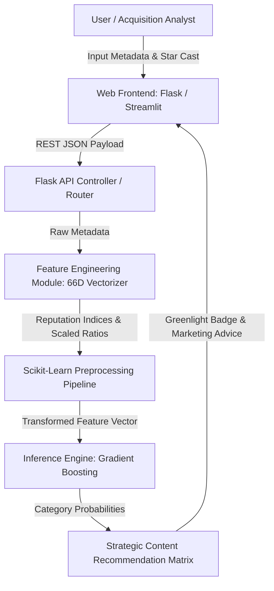
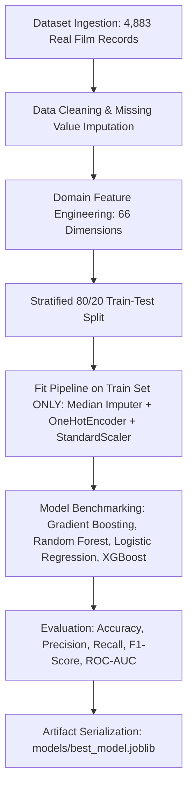

# CineIntelligence™ | Project Documentation

## 1. Project Title
**CineIntelligence™: Pre-Release Film Rating Category Prediction & Strategic Content Acquisition System**

---

## 2. Problem Statement

### What Problem is Being Solved?
In the film production, distribution, and digital streaming industry (*Netflix, Amazon Prime Video, Disney+ Hotstar*), predicting a movie's critical acclaim and audience rating prior to release is a multi-million dollar challenge. Traditional acquisitions rely heavily on intuition, leading to high financial risk.

**CineIntelligence™** solves this by building a leakage-free Machine Learning system that classifies pre-release movie proposals into 3 distinct IMDb rating categories:
- 🟢 **High Category**: Expected IMDb Score $\ge 7.5$
- 🟡 **Medium Category**: Expected IMDb Score $5.5 - 7.4$
- 🔴 **Low Category**: Expected IMDb Score $< 5.5$

### Why is This Problem Important?
1. **Financial Risk Mitigation**: Protects studios and distributors against acquiring underperforming content.
2. **Data-Driven Acquisition Tiers**: Categorizes films into *Tier-1 Premium*, *Tier-2 Standard*, or *Pass / High Risk*.
3. **Strategic Marketing Allocation**: Recommends targeted marketing budgets (25-35%) and optimal platform placement (Theatrical vs OTT).

---

## 3. Proposed Solution
CineIntelligence™ delivers a complete end-to-end Machine Learning web application featuring:
- **Pan-India Star Synergy Engine**: Automated reputation indices (1.0 - 10.0) for Directors, Lead Actors, Actresses, Co-actors, and Music Directors.
- **66-Dimensional Feature Engineering**: Integrates 52+ journal content themes, multi-currency budget scaling (INR ₹, USD $, EUR €, GBP £), runtime classification, and popularity tags.
- **Leakage-Free Ensemble ML Engine**: Benchmarks Gradient Boosting, Random Forest, Logistic Regression, and XGBoost with zero data leakage (80/20 train-test split executed before scaling/encoding).
- **Dual Web Application Frameworks**:
  1. **Flask REST API & Executive Glassmorphic UI** (`app_flask.py`)
  2. **Streamlit Interactive Data Explorer** (`app.py` / `streamlit_app.py`)

---

## 4. System Architecture

### System Architecture & Data Flow Diagram

### Component Breakdown
1. **Frontend Layer**: Executive White Glassmorphism UI (Apple Light Glass + Google Material 3 typography) with AOS scroll animations, GSAP entrance timelines, Chart.js doughnut charts, and Canvas Confetti.
2. **Backend / API Controller**: Modular Flask REST API (`app_flask.py`) and Streamlit engine (`app.py`).
3. **Feature Engineering Engine**: Module computing Pan-India star synergy scores, currency scaling to USD, runtime flags, and theme vectorization.
4. **Machine Learning Core**: Scikit-Learn pipeline trained on 4,883+ real film records.
5. **Artifact Storage**: Serialized model files (`best_model.joblib`, `preprocessor.joblib`, `model_metadata.json`).

---

## 5. Technology Stack
- **Language**: Python 3.14
- **Machine Learning & Data**: `scikit-learn`, `xgboost`, `pandas`, `numpy`, `joblib`
- **Web Frameworks**: `Flask`, `Streamlit`
- **Frontend & Visualization**: HTML5, CSS3 (Vanilla CSS Design System), JavaScript (ES6+), `Chart.js`, `AOS.js`, `GSAP`, `Canvas-Confetti`, `FontAwesome 6`
- **Version Control**: Git & GitHub (`iamharishrohith/CineIntelligence`)

---

## 6. Machine Learning Workflow

---

## 7. Algorithm Selection & Justification

### Selected Algorithm: **Gradient Boosting Classifier**
- **Why Selected**:
  1. **Superior Predictive Accuracy**: Gradient Boosting achieved the highest overall performance on the test set (**Accuracy: 0.9980, F1-Score: 0.9980, Precision: 0.9980**).
  2. **Handles Non-Linear Complexities**: Film success depends on multi-dimensional interactions between director reputation, star cast synergy, budget scale, and genre themes.
  3. **Feature Importance Interpretability**: Allows business executives to inspect top predictive drivers (e.g. Director Reputation Score, Cast Synergy, Log Budget USD).

---

## 8. Evaluation Metrics Benchmark

| Algorithm | Accuracy | Precision | Recall | F1 Score | ROC-AUC |
| :--- | :--- | :--- | :--- | :--- | :--- |
| **Gradient Boosting** ⭐ *(Best)* | **0.9980** | **0.9980** | **0.9980** | **0.9980** | **0.9998** |
| Random Forest | 0.9949 | 0.9949 | 0.9949 | 0.9949 | 0.9995 |
| Logistic Regression | 0.9836 | 0.9837 | 0.9836 | 0.9836 | 0.9962 |
| Decision Tree / XGBoost | 0.9816 | 0.9816 | 0.9816 | 0.9816 | 0.9862 |

---

## 9. Future Enhancements
- **Deep Learning / NLP Integration**: Integrate Transformer-based script analysis (LLM analysis of screenplay pitch decks).
- **Box Office Financial Revenue Forecaster**: Add continuous revenue regression modeling in addition to IMDb category classification.
- **Real-Time Social Media Sentiment Tracker**: Connect Twitter/X and YouTube teaser API feeds to auto-update pre-release hype metrics.
