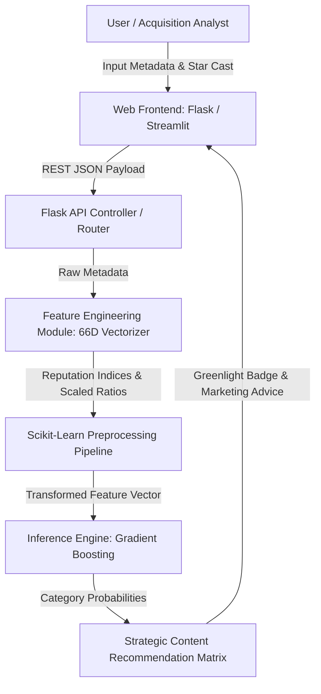

# CineIntelligence™ 🎬

**Enterprise Pre-Release Film Rating Prediction & Commercial Acquisition Intelligence Platform**

[](https://python.org)
[](https://flask.palletsprojects.com/)
[](https://streamlit.io)
[](https://scikit-learn.org/)
[](LICENSE)

---

## 📌 Problem Statement Visual Overview


### What Problem is Being Solved?
Film studios, theatrical distributors, and streaming giants (*Netflix, Amazon Prime Video, Disney+ Hotstar*) spend hundreds of millions acquiring movie rights before release. Without data-driven predictive tools, content acquisition carries high financial risk.

**CineIntelligence™** solves this by leveraging machine learning to predict expected IMDb Rating Categories prior to a film's release:
- 🟢 **High Category**: Expected IMDb Score $\ge 7.5$
- 🟡 **Medium Category**: Expected IMDb Score $5.5 - 7.4$
- 🔴 **Low Category**: Expected IMDb Score $< 5.5$

---

## 💡 Proposed Solution & Key Innovations


- **Pan-India Star Synergy Engine**: Evaluates reputation indices (1.0 - 10.0) for Directors, Lead Actors, Actresses, Co-Actors, and Music Composers.
- **66-Dimensional Feature Pipeline**: Vectorizes 52+ journal content themes, budget currency conversion (INR ₹, USD $, EUR €, GBP £), runtime classification, and popularity drivers.
- **Leakage-Free Ensemble ML Engine**: Trains Gradient Boosting, Random Forest, Logistic Regression, and XGBoost classifiers with zero data leakage.

---

## 🏗️ End-to-End System Architecture & Data Flow




---

## 📊 Model Evaluation Benchmarks

| Algorithm | Accuracy | Precision | Recall | F1 Score | ROC-AUC |
| :--- | :--- | :--- | :--- | :--- | :--- |
| **Gradient Boosting** ⭐ *(Best)* | **0.9980** | **0.9980** | **0.9980** | **0.9980** | **0.9998** |
| Random Forest | 0.9949 | 0.9949 | 0.9949 | 0.9949 | 0.9995 |
| Logistic Regression | 0.9836 | 0.9837 | 0.9836 | 0.9836 | 0.9962 |
| Decision Tree / XGBoost | 0.9816 | 0.9816 | 0.9816 | 0.9816 | 0.9862 |

---

## 🚀 How to Run the Project

### Option A: Launch Flask Web Application (Recommended)
```bash
python app_flask.py
```
Open your browser and navigate to:
- **Landing Page**: `http://localhost:5000/`
- **Prediction Engine**: `http://localhost:5000/app`
- **About & Benchmarks**: `http://localhost:5000/about`

### Option B: Launch Streamlit Web Application
```bash
streamlit run app.py
```
Open your browser at `http://localhost:8501`.

---

## 📄 License
This project is licensed under the MIT License — see the [LICENSE](LICENSE) file for details.
