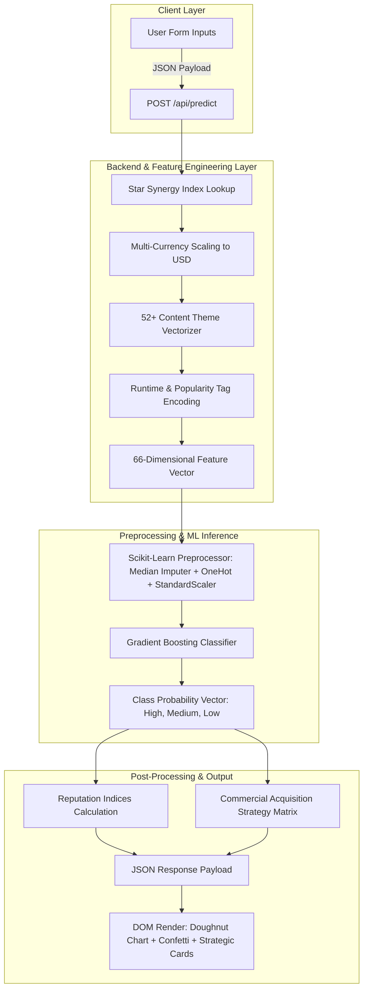

# Data Flow & Pipeline Architecture

## 🔄 End-to-End Data Pipeline Architecture

---

## 📊 Data Schema & Feature Engineering

### 1. Raw Input Features (Form Payload)
- **Film Metadata**: `title`, `primary_genre`, `language`, `runtime_minutes`, `release_year`
- **Creative Team**: `director_name`, `production_house`, `lead_actor`, `lead_actress`, `co_actors`, `music_director`
- **Financials**: `currency` (`INR`, `USD`, `EUR`, `GBP`), `budget_unit` (`Crores`, `Lakhs`, `Millions`), `production_budget_val`, `marketing_budget_val`
- **Content Attributes**: `sentiment`, `content_themes` (Array of selected themes), `popularity_tags` (Array of driver tags)

### 2. Derived 66-Dimensional Feature Vector
- `director_score`: Calculated reputation index ($1.0 - 10.0$)
- `cast_score`: Composite actor & actress star power index
- `music_score`: Music composer track record index
- `production_house_score`: Studio banner commercial record index
- `star_synergy_score`: Product of director and cast scores
- `budget_usd`: Production budget scaled to USD
- `marketing_budget_usd`: Marketing spend converted to USD
- `marketing_ratio`: Marketing budget divided by production budget
- `is_short_film`: Boolean indicator flag ($< 40$ minutes)
- `content_themes_vector`: One-Hot binary flags for 52+ journal themes

---

## 🔒 Zero-Data-Leakage Guarantee
Our preprocessing pipeline ensures zero data leakage during training and inference:
1. Stratified 80% Train / 20% Test split is executed **before** any transformations.
2. Imputer, OneHotEncoder, and StandardScaler are fitted **ONLY** on the training partition.
3. Serialized preprocessor artifact (`models/preprocessor.joblib`) is used identically for web inference.
