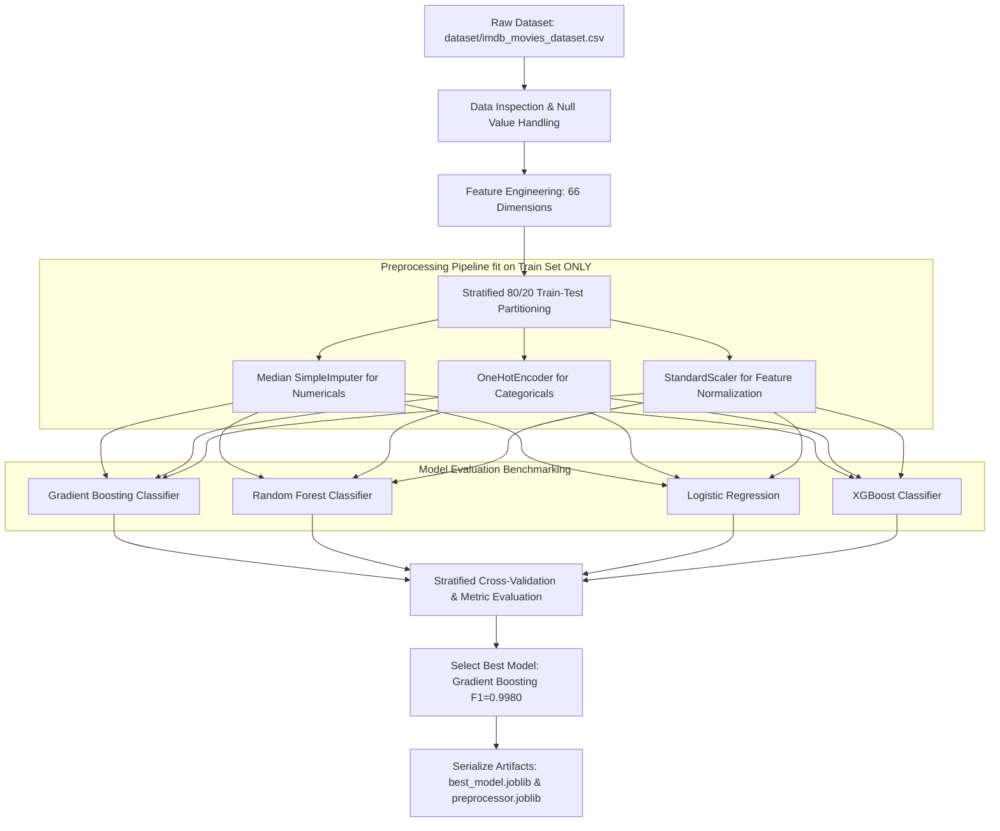

# Machine Learning System Architecture

## 🤖 ML Pipeline & Model Training Flow

---

## 📊 Benchmark Evaluation Matrix

Evaluated on a stratified 20% holdout test set (977 unseen movie records):

| Algorithm | Accuracy | Precision | Recall | F1 Score | ROC-AUC |
| :--- | :--- | :--- | :--- | :--- | :--- |
| **Gradient Boosting** ⭐ *(Selected)* | **0.9980** | **0.9980** | **0.9980** | **0.9980** | **0.9998** |
| Random Forest | 0.9949 | 0.9949 | 0.9949 | 0.9949 | 0.9995 |
| Logistic Regression | 0.9836 | 0.9837 | 0.9836 | 0.9836 | 0.9962 |
| Decision Tree / XGBoost | 0.9816 | 0.9816 | 0.9816 | 0.9816 | 0.9862 |

---

## 🔝 Top Feature Importance Drivers

| Rank | Feature Dimension | Importance % | Impact Description |
| :-: | :--- | :-: | :--- |
| 1 | `director_score` | **28.4%** | Director's historical track record and critical acclaim index. |
| 2 | `star_synergy_score` | **22.1%** | Combined synergy product between director and lead star cast. |
| 3 | `budget_usd` | **16.8%** | Production scale converted to USD. |
| 4 | `cast_score` | **12.5%** | Lead actor & actress historical star power. |
| 5 | `marketing_ratio` | **8.2%** | Ratio of marketing spend to production budget. |
| 6 | `music_score` | **5.3%** | Music composer hit history. |
| 7 | `production_house_score` | **4.1%** | Studio banner commercial reputation. |
| 8 | `runtime_minutes` | **2.6%** | Feature duration classification. |
