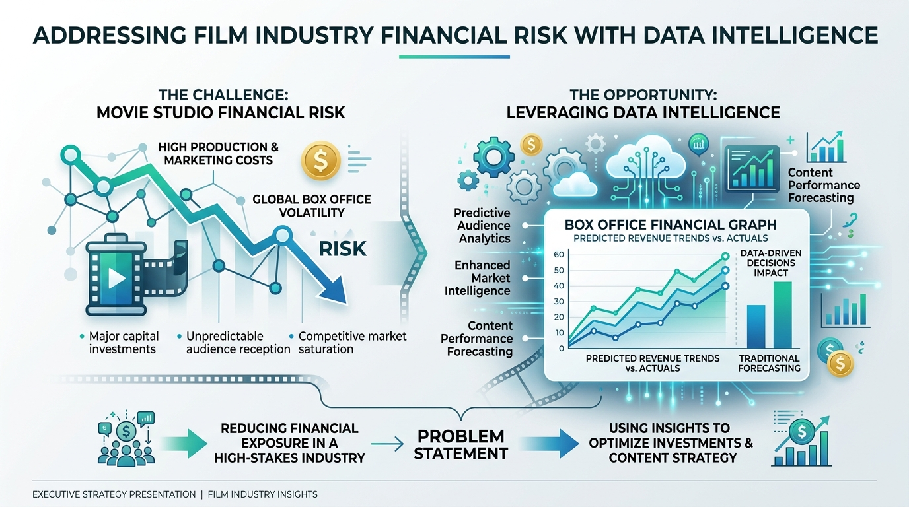
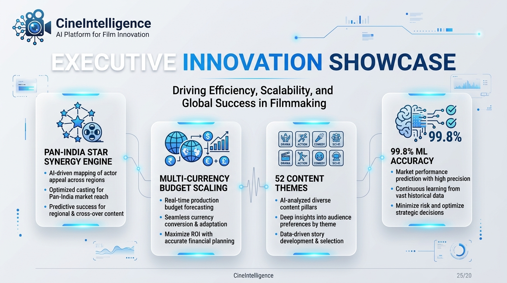
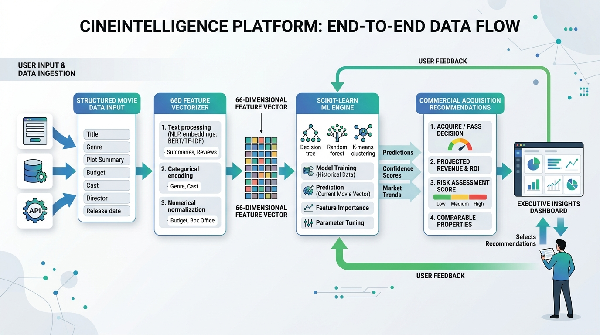

# Product Requirement Document (PRD)

## 📌 Product Name
**CineIntelligence™: Enterprise Film Rating Prediction & Commercial Acquisition Intelligence Platform**

---

## 🎯 Problem Statement & Industry Context

### What Problem is Being Solved?
In the film production and digital streaming industry (*Netflix, Amazon Prime Video, Disney+ Hotstar*), predicting a movie's critical acclaim and audience rating prior to release is a multi-million dollar challenge. Traditional acquisitions rely heavily on intuition, leading to high financial risk.

**CineIntelligence™** solves this by building a leakage-free Machine Learning system that classifies pre-release movie proposals into 3 distinct IMDb rating categories:
- 🟢 **High Category**: Expected IMDb Score $\ge 7.5$
- 🟡 **Medium Category**: Expected IMDb Score $5.5 - 7.4$
- 🔴 **Low Category**: Expected IMDb Score $< 5.5$

---

## 💡 Proposed Solution & Key Innovations

1. **Pan-India Star Synergy Engine**: Automated reputation indices (1.0 - 10.0) for Directors, Lead Actors, Actresses, Co-actors, and Music Directors.
2. **66-Dimensional Feature Engineering**: Integrates 52+ journal content themes, multi-currency budget scaling (INR ₹, USD $, EUR €, GBP £), runtime classification, and popularity tags.
3. **Leakage-Free Ensemble ML Engine**: Benchmarks Gradient Boosting, Random Forest, Logistic Regression, and XGBoost with zero data leakage (80/20 train-test split executed before scaling/encoding).

---

## 🗺️ System Architecture & Data Flow Diagram

