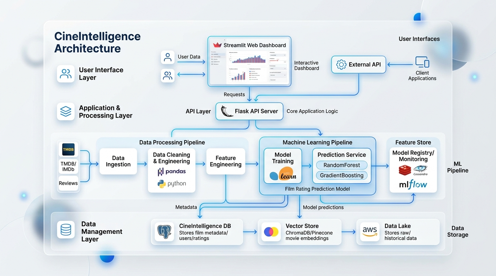

# Product Requirement Document (PRD)

## 📌 Product Name
**CineIntelligence™: Enterprise Film Rating Prediction & Commercial Acquisition Intelligence Platform**

---

## 🎯 Executive Summary & Vision
CineIntelligence™ is an enterprise AI decision-support platform designed for theatrical film distributors, OTT streaming platforms (*Netflix, Amazon Prime Video, Disney+ Hotstar*), and film production studios.

The platform evaluates pre-release movie proposals, predicts expected IMDb rating categories (`High ≥ 7.5`, `Medium 5.5 - 7.4`, `Low < 5.5`), and generates automated commercial acquisition strategies, risk badges, and marketing budget allocations.

---

## 👥 Target Users & User Personas

### 1. OTT Content Acquisition Executive
- **Goal**: Evaluate incoming film distribution proposals and pitch decks.
- **Pain Point**: High risk of overpaying for movie rights that perform poorly on streaming carousels.
- **Need**: Data-backed IMDb category prediction, greenlight acquisition badges, and platform placement recommendations (*Prime-Time Digital Premiere vs Ad-Supported Catalog*).

### 2. Theatrical Distributor & Studio Head
- **Goal**: Decide theatrical screen allocation and pre-release promotional budgets.
- **Pain Point**: Balancing production budget with marketing spend without clear box-office signals.
- **Need**: Pan-India star synergy ratings, marketing budget allocation percentages (25-35%), and multi-currency budget converters.

### 3. Film Producer & Screenwriter
- **Goal**: Optimize creative team selection (Director, Star Cast, Music Composer) before pitching to financiers.
- **Pain Point**: Lack of quantitative feedback on how star power and theme choices impact film rating probability.
- **Need**: Interactive star synergy sliders, 52+ content theme tag selection, and Instant Test Presets.

---

## 🚀 Key Functional Requirements

| ID | Feature Module | Functional Requirement Description | Priority |
| :-: | :--- | :--- | :-: |
| **FR-1** | **Star Synergy Engine** | Calculate automated reputation indices (1.0 - 10.0) for Directors, Lead Actors, Actresses, Co-actors, and Music Directors. | `P0` |
| **FR-2** | **Multi-Currency Budget Converter** | Convert production and marketing budgets across `INR (₹)`, `USD ($)`, `EUR (€)`, `GBP (£)` and units (`Crores`, `Lakhs`, `Millions`). | `P0` |
| **FR-3** | **Content Theme Vectorizer** | Multi-select input for 52+ journal content themes and popularity driver tags. | `P0` |
| **FR-4** | **ML Rating Classifier** | Execute 66D feature inference via Gradient Boosting Model to predict `High`, `Medium`, or `Low` rating classes. | `P0` |
| **FR-5** | **Strategic Advice Matrix** | Output commercial acquisition tier, marketing percentage allocation, and platform placement advice. | `P1` |
| **FR-6** | **Instant Test Presets** | 1-Click buttons (`🔥 High Test`, `⚡ Medium Test`, `⚠️ Low Test`) to instantly pre-fill form scenarios. | `P1` |
| **FR-7** | **Interactive Visualization** | Render class probability doughnut charts (`Chart.js`) and animated counter tickers. | `P1` |

---

## 🎨 Non-Functional Requirements

- **UI/UX Aesthetics**: Executive White Glassmorphism styling (Apple Light Glass + Google Material 3 typography).
- **Latency & Performance**: ML inference API response time under $150\text{ms}$.
- **Mobile Responsiveness**: 100% responsive grid layout across desktop, tablet, and mobile screens ($16\text{px}$ input fields to prevent iOS auto-zoom).
- **Data Integrity**: Zero data leakage in ML preprocessing pipeline (80/20 train-test split before scaling).

---

## 📈 System Architecture Diagram

