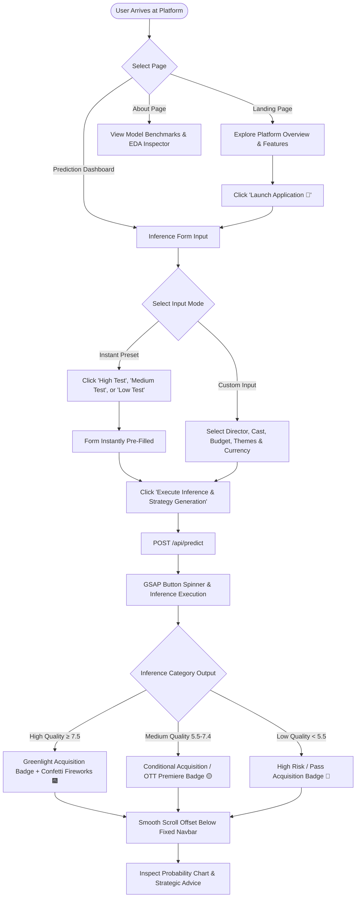

# User Flow & Interaction Journey

## 🗺️ System Navigation Map
CineIntelligence™ provides a simple 3-page user architecture:
1. **`Home Landing Page` (`/`)**: High-impact hero section, feature showcase, metrics, and application CTA.
2. **`Prediction Engine Dashboard` (`/app`)**: Interactive film specification form, Pan-India star cast dropdowns, 52+ theme chips, test presets, and ML inference output cards.
3. **`About & Architecture Page` (`/about`)**: Detailed model benchmarks table, EDA dataset inspector, and system data flow architecture.

---

## 🔄 End-to-End User Flowchart

---

## 📱 Mobile UI Interaction Experience
1. **Header Alignment**: Compact sticky glass navbar with scaled $48\text{px}$ brand logo.
2. **Preset Buttons**: Touch-friendly top preset bar for rapid 1-tap testing.
3. **Form Fields**: $16\text{px}$ input fields to prevent iOS Safari auto-zoom.
4. **Result Card**: Smooth scroll alignment positioning the results card $90\text{px}$ below the top navbar for un-occluded viewing.
